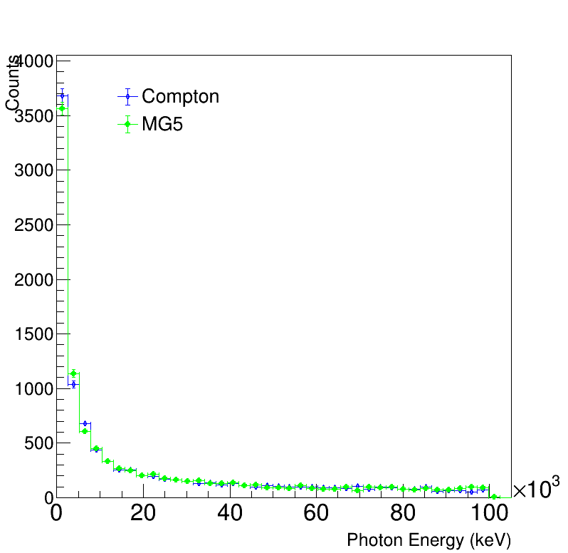
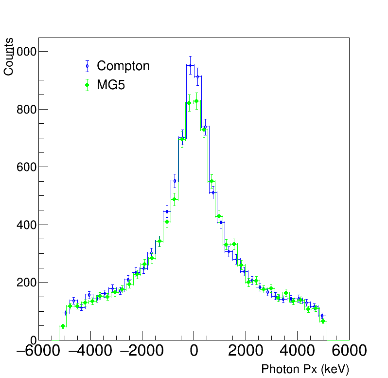
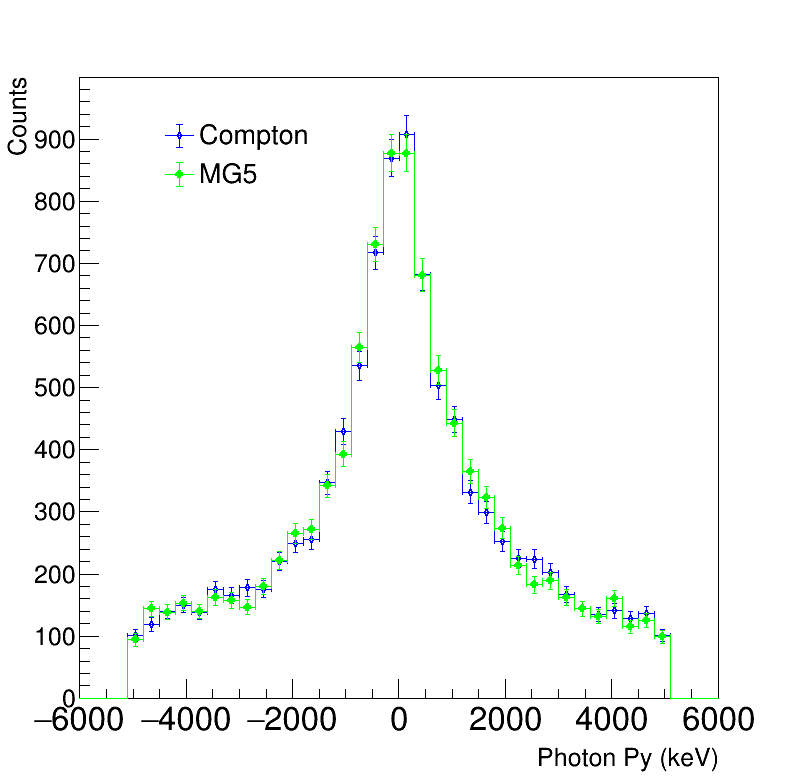
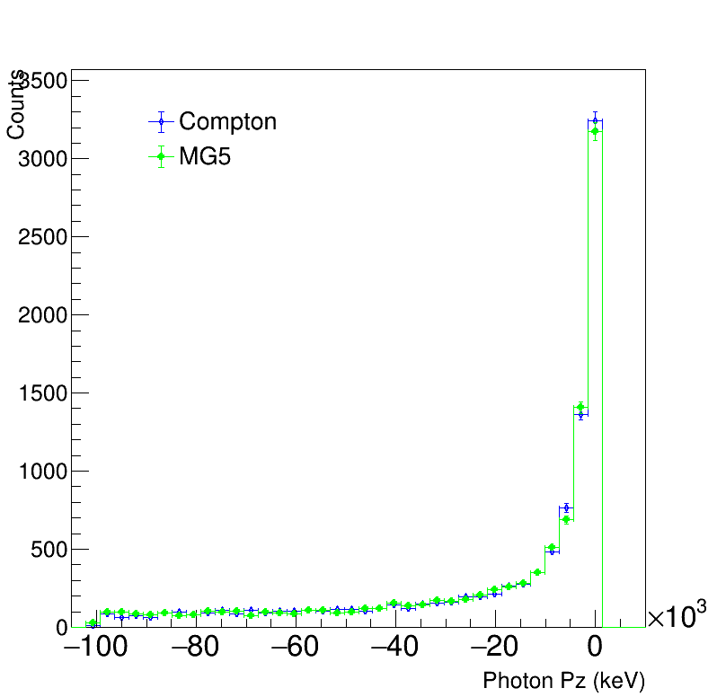
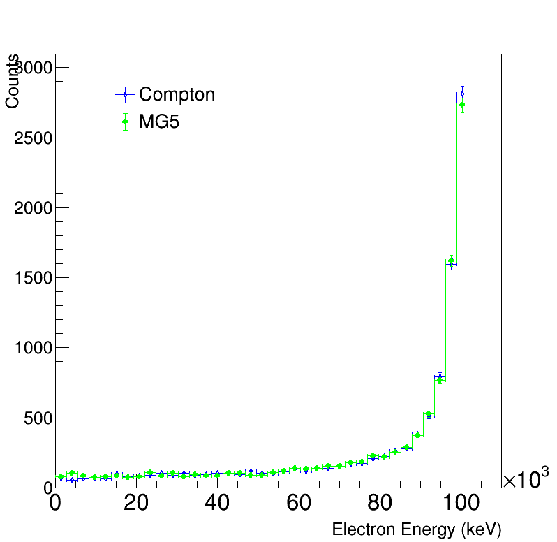
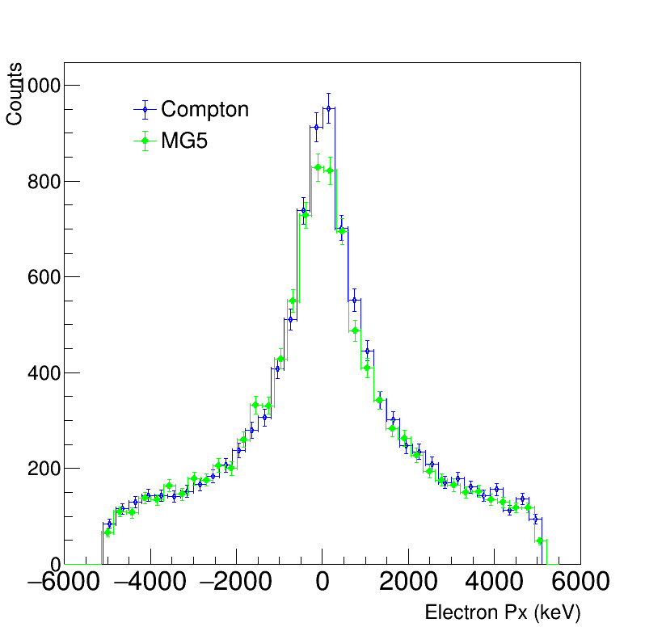
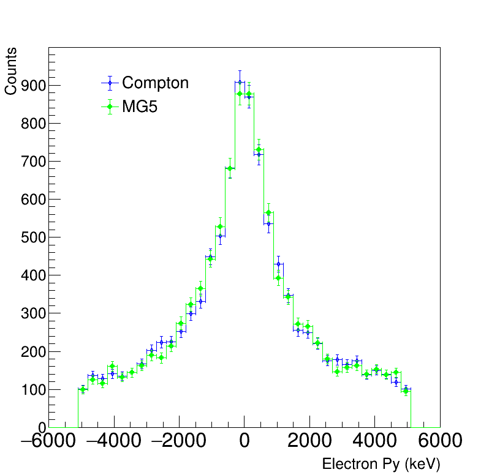
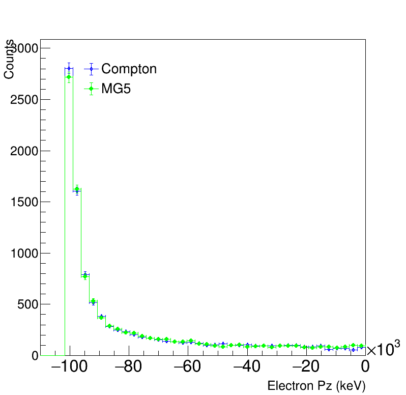

# CompScat
[](https://github.com/amanmdesai/compscat/blob/master/LICENSE.txt)
[](https://github.com/amanmdesai/compscat/actions)
[](https://results.pre-commit.ci/latest/github/amanmdesai/compscat/master)
[](https://github.com/amanmdesai/compscat/actions/workflows/dependency-review.yml)
[](https://github.com/psf/black)
[](https://github.com/amanmdesai/compscat/VERSION)
[](https://www.python.org/downloads/release/python-380/)
[](https://www.python.org/downloads/release/python-390/)
[](https://www.python.org/downloads/release/python-3100/)
[](https://mybinder.org/v2/gh/amanmdesai/compscat/HEAD)

## Author
Aman Desai

##  Description

Monte Carlo simulation of fixed target Compton scattering. The study has been compared with Madgraph5amc_NLO MC event generator The full analysis can be found here [LINK](https://github.com/amanmdesai/compscat/tree/master/analysis). The analysis is currently done in c++ (ROOT Framework). To analyse the Madgraph LHE file, a LHE reader deverloped [here](https://github.com/amanmdesai/LHE-Reader) is used.

## Physics

--- this section explains the physics involved in CompScat ---

## Validation of CompScat

The following plots compare the final states for CompScat with the Madgraph5amc_NLO final states.

### Cross section
Evaluated using $10^6$ phase points with CompScat and using the Madgraph file as given in analysis folder.

Plot showing the cross section versus energy (with error bars):
<p align="center">

</p>


| Initial Photon Energy | CompScat $\sigma$ (milibarn) | Madgraph $\sigma$ (milibarn)|
| ----------------------| --------- | ------|
|  50 MeV  | 15.585 $\pm$ 0.0495 |  15.57 $\pm$ 0.037  |
| 100 MeV  | 8.799 $\pm$ 0.0361  |  8.799 $\pm$ 0.028   |
| 200 MeV  |  4.857 $\pm$ 0.0255  |  4.87 $\pm$ 0.019    |
| 300 MeV  |  3.414 $\pm$ 0.0205  |  3.43 $\pm$ 0.0081    |
| 400 MeV  |  2.669 $\pm$ 0.0185  |  2.664 $\pm$ 0.0051    |
| 500 MeV  |  2.194 $\pm$ 0.0161  |  2.203 $\pm$ 0.0044   |


### Photon final state kinematics






### Electron final state kinematics






## Installation
```bash
git clone https://github.com/amanmdesai/compscat.git
cd compscat
pip install .
```

## Run the generator!

Description of the example in notebooks:

To import the library use
```python
from compscat import *
```
and then set the energy of the incoming photon in MeV:
```python
E = 0.1
```

The step below is the crucial step as the Cross Section is evaluated here. Only the energy is passed as an argument.
```python
w_sum, w_square, w_max = compscat.CrossSection(
    E / compscat.constants.m
).integrate_xsec()
```
The script below will generate the events according to the w_max obtained above and Energy specified by the user. Moreover, the below class will also save the events (either as root or in a csv file). To save in root format use:
```python
compscat.SaveEvent(10000, w_max, E).to_root()
```
else to save them in a csv file use:
```python
compscat.SaveEvent(10000, w_max, E).to_csv()
```
Finally the scripts below will plot the data and store it as pdf. If you have saved the events in a root format use:
```python
compscat.PlotData.file("MC_compton.root")
```
else if you are using csv file, use:
```python
compscat.PlotData.file("MC_compton.csv")
```
## Exercises

* Evaluate the cross section of compton scattering using the `CrossSection` module for different initial proton energies. Plot the same.

* Study the final states at different energies and plot them on the same plot.

* Find the angles $\phi$ and $\theta$ of scattering.

* Make a 2D plot of the energy of photon/electron with the angle of scattering ( $\phi$ and $\theta$).

## To do

Lorentz Transformation from fixed target frame to center of mass frame. (for the next version.)

## Acknowledgements


## References

* Griffiths?
*
